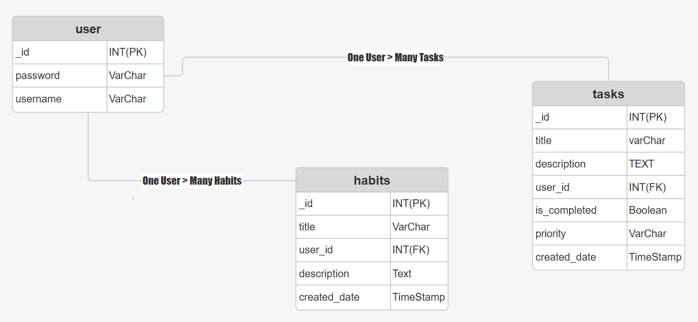

# Tasks&Habits
## Date: 11/11/2025

### By: Naser hubaishi
### | [Naser GitHub](https://github.com/envwx)
### | [Trello](https://trello.com/b/3GzNRerW/my-trello-board)
***
### ***Description***
Tasks&Habits, an app to keep on track of your tasks and able to create habits that matches your daily life
***

####
***
## ERD & Figma
###  
### | [Figma Link](https://www.figma.com/design/GodwZBFJ4qW0YaEdEcQasu/Tasks-Habits?node-id=0-1&p=f&t=1INiBVEnRvEZjRuy-0)
***
### ***Technologies used in our project***
  *
  *
  *
  *
  *
  *
  *

***

# Featuring in the project

*
*
*
*
*
*
*
*
*
***

## ***Project Preview***

  ***

## ***Future Work***
*
*
*

## ***References ***

